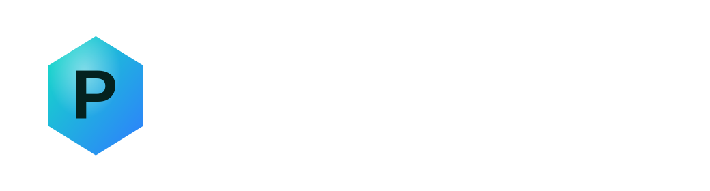

# Prepwise: Assessment Games and Interview Practice

<p align="center">
  <a href="https://prepwise.work/">
    
  </a>
</p>

<p align="center">
  Practice game-based assessments, rehearse one-way video interviews, and improve answers with transcript-based coaching.
</p>

<p align="center">
  <a href="https://prepwise.work/"><strong>Open Prepwise</strong></a>
  ·
  <a href="https://prepwise.work/hirevue-assessment-practice">Assessment practice guide</a>
  ·
  <a href="https://prepwise.work/hirevue-video-interview-practice">Video interview guide</a>
  ·
  <a href="https://prepwise.work/faq">FAQ</a>
</p>

> Prepwise is an independent candidate-preparation platform. It is not affiliated with, endorsed by, or connected to HireVue or any employer named in its public guides. Product and employer names are used descriptively.

## What Prepwise Does

Prepwise brings three preparation workflows into one browser-based platform:

| Practice mode | What the candidate does | What Prepwise adds |
| --- | --- | --- |
| Game-based assessment | Practises timed cognitive and work-style tasks | Real timers, adaptive difficulty, mistake review, focus drills, progress tracking and company-pack mock flows |
| One-way video interview | Records answers under preparation and answer timers | Camera and microphone check, editable transcript, local replay/download and answer-specific AI coaching |
| General interview coach | Prepares for a live interview using a vacancy and optional CV | Role-fit questions, adaptive follow-ups, transcript coaching and questions to ask the interviewer |

Candidates can [try Prepwise in the browser](https://prepwise.work/) before choosing a paid plan.

## Why This Repository Exists

This is the public resource and documentation repository for [Prepwise](https://prepwise.work/). It provides:

- practical interview and assessment preparation guides;
- a transparent explanation of the coaching framework;
- a place to report inaccurate or outdated company-assessment information;
- a public route for feature requests and product feedback;
- links to the official Prepwise platform and its research pages.

The production application and its private backend are not distributed from this repository.

## Interview Coaching: What the Feedback Actually Covers

Prepwise does not apply one rigid template to every answer. It first identifies the type of question and then chooses the relevant coaching criteria.

| Question type | Framework Prepwise expects | Typical coaching focus |
| --- | --- | --- |
| Behavioural or competency | STAR or another clear evidence structure | Situation, task, personal action, result, specificity and impact |
| Motivation or company fit | Motivation, evidence, connection and forward fit | Why this role, why this organisation, credible evidence and a specific contribution |
| Tell me about yourself | Present, relevant past and future fit | Relevance, narrative, brevity and connection to the vacancy |
| Technical or knowledge | Direct answer, reasoning, evidence and limitations | Accuracy, prioritisation, explanation and application |
| Situational or judgement | Decision, rationale, stakeholders and trade-offs | Judgement, risk awareness, communication and next steps |

Feedback can include:

- an overall coach rating and category-level ratings;
- missing evidence or unanswered parts of the question;
- structure and clarity issues;
- filler-word and concision notes where relevant;
- a stronger rewritten answer;
- a delivery cue for the next recording;
- role-fit observations grounded in the vacancy;
- adaptive follow-up questions in General Interview Coach mode.

Read the full [interview coaching framework](docs/interview-coaching-framework.md).

## Game-Based Assessment Practice

Prepwise includes practice for a range of cognitive and work-style assessment mechanics, including:

- Numerosity;
- Digit Span;
- Disco Numbers;
- Shape Dance;
- Flashback;
- Puzzle Picture;
- Pathfinder;
- Portrait and PortraitXT;
- Teamchat;
- Singularity;
- E-Motions.

Some exercises produce a level or accuracy score. Work-style exercises are treated as practice-only where a meaningful performance score would be misleading.

Start with the [game-based assessment practice guide](https://prepwise.work/hirevue-game-based-assessment-practice) or read the repository's [practice principles](docs/game-based-assessment-practice.md).

## A Typical Prepwise Workflow

```text
Choose the assessment or interview mode
                ↓
Add the target company and vacancy
                ↓
Practise under realistic timing
                ↓
Review mistakes or edit the answer transcript
                ↓
Receive targeted drills or answer coaching
                ↓
Repeat the weakest part
```

For one-way interviews, the core loop is:

```text
Record answer → transcribe → edit transcript → get coaching → answer again
```

The video remains local to the browser during practice. If browser transcription is unavailable, cloud transcription is only used after the user chooses that fallback.

## Public Guides

### Interview preparation

- [HireVue assessment practice](https://prepwise.work/hirevue-assessment-practice)
- [HireVue video interview practice](https://prepwise.work/hirevue-video-interview-practice)
- [One-way video interview practice](https://prepwise.work/one-way-video-interview-practice)
- [Graduate video interview questions](https://prepwise.work/graduate-video-interview-questions)
- [Interview preparation checklist](docs/one-way-video-interview-checklist.md)

### Assessment games

- [Game-based assessment practice](https://prepwise.work/hirevue-game-based-assessment-practice)
- [All Prepwise game guides](https://prepwise.work/guides/)
- [Company assessment map](https://prepwise.work/company-hirevue-assessment-map)
- [How Prepwise treats company-assessment evidence](docs/company-assessment-research.md)

### Product and evidence

- [Why Prepwise](https://prepwise.work/why-prepwise)
- [Why focused training helps](https://prepwise.work/why-training-helps)
- [Research behind the practice approach](https://prepwise.work/backed-by-science)
- [Privacy, pricing and product FAQ](https://prepwise.work/faq)
- [About the founder](https://prepwise.work/about)

## Candidate-First Principles

Prepwise is designed around five practical principles:

1. **Practise the real interaction, not generic advice.** Timers, input mechanics, camera checks and repeated answers matter.
2. **Ground coaching in evidence.** Feedback refers to the question, transcript, vacancy and relevant answer framework.
3. **Do not force STAR everywhere.** STAR is useful for behavioural evidence, not for every motivation, knowledge or introductory question.
4. **Be conservative about employer claims.** Assessment formats can vary by role, country and year.
5. **Keep candidates in control of their data.** Vacancy and CV reuse is browser-based, and local video is not uploaded as part of normal rehearsal.

## Contribute or Report an Issue

Public contributions that improve candidate preparation are welcome.

- [Report outdated company-assessment information](../../issues/new?template=company-assessment-report.yml)
- [Request a company or programme guide](../../issues/new?template=company-guide-request.yml)
- [Suggest a product improvement](../../issues/new?template=feature-request.yml)

Please do not post invitation emails, personal data, proprietary test questions, assessment screenshots or content covered by an employer confidentiality agreement.

See [CONTRIBUTING.md](CONTRIBUTING.md) for the evidence standard.

## Security

Do not open public issues containing credentials, personal data or a vulnerability that could affect candidates. Follow the private reporting process in [SECURITY.md](SECURITY.md).

## Brand and Licence

The written resources in this repository are available under the terms in [LICENSE](LICENSE). Prepwise names, logos and brand assets are not licensed for reuse.

© 2026 Prepwise.
